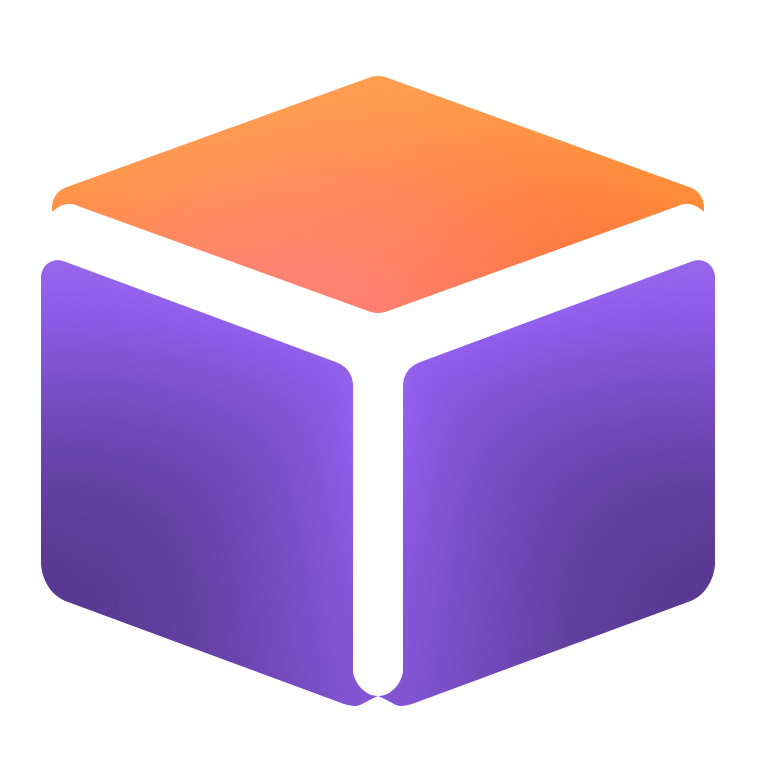

<p align="center">
  <a href="https://edgestore.dev"></a>
  <a href="https://edgestore.dev"><picture>
      <source media="(prefers-color-scheme: dark)" srcset="docs/public/img/edgestore.svg" />
      
  </picture></a>
</p>

<p align="center">Type-safe file uploads for TypeScript and React.</p>

<p align="center">
  <a href="https://edgestore.dev">Website</a> ·
  <a href="https://edgestore.dev/docs/quick-start">Documentation</a> ·
  <a href="https://dashboard.edgestore.dev">Dashboard</a> ·
  <a href="https://discord.gg/HvrnhRTfgQ">Discord</a>
</p>

## What is EdgeStore?

EdgeStore handles file uploads and storage for TypeScript and React applications.

## Features

- 🧩 **End-to-end type safety.** Define your server router once and get inferred types in your React client.
- ☁️ **Your choice of storage.** Use [EdgeStore's hosted storage](https://edgestore.dev/docs/providers/edgestore), [S3-compatible storage](https://edgestore.dev/docs/providers/s3), or [Azure Blob Storage](https://edgestore.dev/docs/providers/azure-blob). Connect other storage services with a [custom provider](https://edgestore.dev/docs/providers/custom).
- 🔒 **Validation and authorization.** Set file size and type limits, and use your existing authentication to control uploads and deletions.
- 🎨 **Ready-made upload components.** Customizable dropzones, image previews, and progress indicators for React.
- 📤 **Upload controls.** Track progress, cancel uploads, and limit parallel uploads.
- 🏷️ **Metadata and file paths.** Organize files using typed input and application context.
- 🔌 **Framework adapters.** Integrate with Next.js, TanStack Start, Remix / React Router, Astro, Hono, Express, or Fastify.
- 🤖 **Coding-agent support.** Skills, plugins, MCP tools, and API references bundled with your installed packages.

## Use with an agent

Give your coding agent this prompt:

```text
Read https://edgestore.dev/SKILL.md and add file uploads to this application.
```

For skills, plugins, and MCP connections, see [agent setup](https://edgestore.dev/docs/agents).

## Documentation

- [Quick start](https://edgestore.dev/docs/quick-start)
- Framework guides: [Next.js](https://edgestore.dev/docs/adapters/next), [TanStack Start](https://edgestore.dev/docs/adapters/tanstack-start), [Remix / React Router](https://edgestore.dev/docs/adapters/remix), [Astro](https://edgestore.dev/docs/adapters/astro), [Hono](https://edgestore.dev/docs/adapters/hono), [Express](https://edgestore.dev/docs/adapters/express), and [Fastify](https://edgestore.dev/docs/adapters/fastify)
- [Upload components](https://edgestore.dev/docs/components/multi-file)
- [Example applications](./examples)

## Community

Questions and ideas are welcome on [Discord](https://discord.gg/HvrnhRTfgQ).
For bugs and contributions, [open an issue](https://github.com/edgestorejs/edgestore/issues)
or [submit a pull request](https://github.com/edgestorejs/edgestore/pulls).

[Release notes](https://github.com/edgestorejs/edgestore/releases) · [MIT license](./LICENSE)
